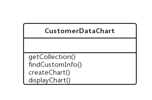
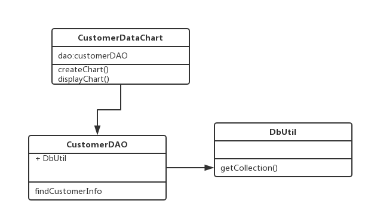

## 设计模式六大原则
### 单一职责原则
#### 定义
一个类只负责一个功能领域中的相应职责，或者可以定义为：就一个类而言，应该只有一个引起它变化的原因。
#### 解释：
高内聚、低耦合。一个类以及方法，不能承担过多的功能，否则会更容易出现耦合情况，也就是其中一个小功能变化将会影响到其它功能。
#### 举例
比如有一个功能是客户信息图形统计功能



如果是这样设计，则会导致如果数据连接、查询、创建图表和显示图表有一个要改变，则都要改变该类的源代码，而且数据连接、查询这些如果别的地方使用也会调用该类，耦合度变高而且不好拓展

==按照单一职责原则优化可以将原先的CustomerDataChart拆成多个类==



改造成这样，则耦合度变低，而且拓展好拓展

### 开闭原则
#### 定义
一个软件实体对扩展开放，对修改关闭

#### 解释
主要就是采取抽象化去达到这个开闭原则，比如使用抽象类、接口等形式，如果有拓展功能采取在实现类中去拓展的方式实现。这样就不会去修改抽象层，来新需求只要添加对应的具体类去实现。
#### 举例
比如：要实现不同图表的展示功能如果是这样设计就不符合开闭原则

```
class ChartDisplay {
	void display(String type) {
		if (type == 长方形) {
			new 长方形
			调用长方形的display
		}
		if (type == 圆形) {
			new 圆形
			调用圆形的display
		}
	}
}

```
如果是这样设计则如果新加一个图形的展示，就要在chartDisplay类中新加代码，不符合开闭原则，现在改成这样。

```
abstract class AbstractChart {
 	abstract void display();
}
class ChartDisplay {
	AbstractChart chart;
	public ChartDisplay(AbstractChart chart) {
		this.chart = chart;
    }
	void display() {
		chart.display();
	}
}
class Rectangle extends AbstractChart {
	void display() {
	}
}
class Round extends AbstractChart {
	void display() {
	}
}

new ChartDisplay(new Rectangle()).display();
new ChartDisplay(new Round()).display();

```
这样设计如果要拓展其他图形的展示只要去继承AbstractChart然后实现其display()方法，其他地方都不用变就可以，所以符合开闭原则


### 里氏替换原则
#### 定义
所有引用基类（父类）的地方必须能透明地使用其子类的对象。
#### 解释
就是在代码中将基类对象替换成子类对象，代码不会出现任何异常，反过来则不成立，比如一个地方使用子类如果替换成基类则会出错。

> 里氏代换原则是实现开闭原则的重要方式之一，由于使用基类对象的地方都可以使用子类对象，因此==在程序中尽量使用基类类型来对对象进行定义，而在运行时再确定其子类类型，用子类对象来替换父类对象==。

使用里氏代换原则时需要注意如下几个问题：

1. 子类的所有方法必须在父类中声明，或子类必须实现父类中声明的所有方法。根据里氏代换原则，为了保证系统的扩展性，在程序中通常使用父类来进行定义，如果一个方法只存在子类中，在父类中不提供相应的声明，则无法在以父类定义的对象中使用该方法。
2. (2) 我们在运用里氏代换原则时，尽量把父类设计为抽象类或者接口，让子类继承父类或实现父接口，并实现在父类中声明的方法，运行时，子类实例替换父类实例，我们可以很方便地扩展系统的功能，同时无须修改原有子类的代码，增加新的功能可以通过增加一个新的子类来实现。里氏代换原则是开闭原则的具体实现手段之一

#### 举例
和开闭原则举例差不多。原始代码：

```
	//邮件发送类
	class EmailSender() {
		void sendCommonUser(CommonUser commonUser) {};
		void sendVipUser(VipUser vipUser) {};
	}
	class CommonUser{
		String address;
		String name;
	}
	class VipUser{
		String address;
		String name;
	}

```
> 存在的不足：重复代码较多，普通用户和vip用户邮件发送逻辑一样只是内容不一样。而且有其它用户类型时不好扩展。

改造后的代码：

```
	abstract class User {
		String name;
		String address;
		
		set get
	}
	//邮件发送类
	class EmailSender() {
		void send(User user) {};
	}
	class CommonUser extends User{
		
	}
	class VipUser extends User{
		
	}
	
	new EmainSender().send(new CommonUser);
	new EmainSender().send(new VipUer);
	...

```
> 改造后符合开闭原则、扩展性好，代码重复率低

**里氏替换原则核心：针对基类编程，在程序运行时在确定具体子类**

### 依赖倒置原则
#### 定义
抽象不应该依赖于细节，细节应当依赖于抽象。换言之，要针对接口编程，而不是针对实现编程。
#### 解释
 
就是在我们的代码中传递参数时尽量引用层次高的抽象层类，即使用接口和抽象类进行变量类型声明、参数类型声明、方法返回类型声明，以及数据类型的转换等，而不要用具体类来做这些事情。为了确保该原则的应用，一个具体类应当只实现接口或抽象类中声明过的方法，而不要给出多余的方法，否则将无法调用到在子类中增加的新方法。

#### 举例
将不同格式的文件中用户信息转存到数据库，这个时候就需要不同格式的文件需要对应的转换器。

设计1

```
	
	class TextDataConvertor() {
		void convertor() {};
	}
	class XmlDataConvertor {
		void convertor() {};
	}
	class UserDAO {
		void addUserInfo() {
			new 不同的转换器
		}
	}
	

```

> 不容易扩展，不符合开闭原则

设计2

```
	
	abstract class DataConvertor {
		abstract void convertor();
	}
	
	//这个地方具体子类的初始化也可以借助配置文件xml的形式去实现，如果拓展可以在对应的xml配置文件中新增实现类。
	class UserDAO() {
		void addUserInfo() {
			读取xml配置文件
			针对抽象层类DataConvertor编程实现，在运行的时候确定具体子类
		}
	}
	class TextDataConvertor extends User{
		
	}
	class XmlDataConvertor extends User{
		
	}
	
```

==**总结在上述重构过程中，我们使用了开闭原则、里氏代换原则和依赖倒转原则。但是在大多数的情况下，这三个原则会同时出现，很相似。其实开闭原则，是我们的目标，最后方案得符合开闭原则才行，然后里氏替换原则是基础也是验证（就是把基类替换成子类，程序不会出错才算合理的设计），最后依赖倒转原则是方法和手段吧。**== 

### 接口隔离原则
#### 定义
使用多个专门的接口，而不使用单一的总接口，即客户端不应该依赖那些它不需要的接口。
#### 解释
就是当一个接口太大时，我们按一定规则把它拆成若干小接口。使用该接口的类只需要知道与其相关的方法即可，==每一个接口应该承担一种相对独立的角色，不干不该干的事，该干的事都要干。==如果一个接口中方法过多，别的类在实现的时候可能只需要实现其中的几个方法，和自己无关方法也要去实现即使方法体什么都不做，这样也不太好。所以要按规则去拆分大接口。
#### 举例
比如一个用户数据显示模块。如果把所有功能都写在一个接口里则会形成这样的一个接口

```
public interface UserDataDisplay {
 	void dataRead();
 	void vonvertorXmlData();
 	
 	void createChart();
 	void displayChart();
 	
 	void createReport();
 	void displayReport();
}

piblic class ConcreteDisplay implements UserDataDisplay {
	实现接口UserDataDisplay所有的方法，但是该具体对象只要用到展示也就是display的方法
}

```
重构后：

```
public interface DataHandler {
 	void dataRead();
 	void vonvertorXmlData();
}

public interface DataDisplay {
 	void createChart();
 	void displayChart();
}

public interface DataReport {
 	void createReport();
 	void displayReport();
}

piblic class ConcreteDisplay implements DataDisplay {
	需要什么功能实现对应的接口
}

```

### 迪米特法则
#### 定义
一个软件实体应当尽可能少地与其他实体发生相互作用。
#### 解释
应该尽量减少对象之间的交互，如果两个对象之间不必彼此直接通信，那么这两个对象就不应当发生任何直接的相互作用，如果其中的一个对象需要调用另一个对象的某一个方法的话，可以通过第三者转发这个调用。简言之，就是通过引入一个合理的第三者来降低现有对象之间的耦合度。
#### 举例
比如如果一个页面一个控件的事件触发将导致多个控件产生相应的响应，如果要是每个控件都进行交互，则会导致每个控件之间的联系比较紧密，比如button会调用text，text也会调用label，然后button也会调用label，也会调用combobox等。

如果按照迪米特法则这样设计就不合理，耦合太高，不够灵活。

重构后：使用一个中间的类去交互比如控件类（control），在这个类中去管理所有控件的行为，所有控件去调用别的控件的时候都通过该中间控件类去实现，这样如果想增加别的控件只需要在这个中间件中去实现然后暴露出方法给别的地方使用即可，其它的都不用改变。降低耦合


